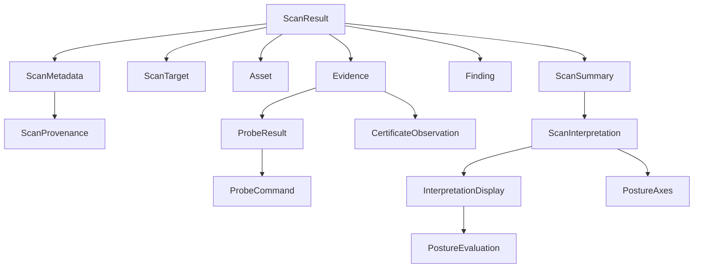
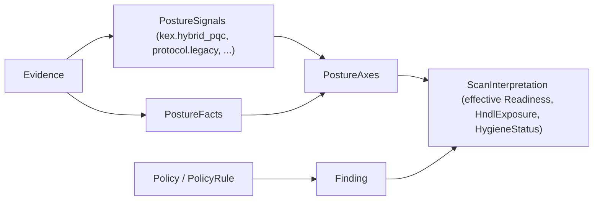
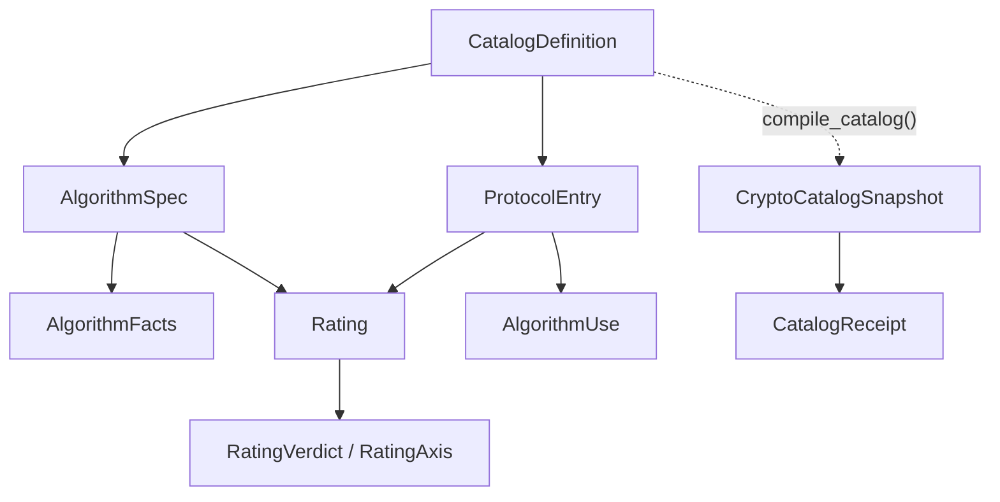

<!-- SPDX-License-Identifier: Apache-2.0 -->
<!-- The enum table and the full relationship graph below are generated by
     scripts/gen_data_model.py. Regenerate them after any model change; do not hand-edit. -->

# Data model and relationships

QuReddy turns one scan into one verdict. This page shows every class, every enum, and how
they connect, and it tells the story of how a target becomes a graded result. It is generated
from the source so it cannot drift.

## Contents

1. [The story in one breath](#1-the-story-in-one-breath)
2. [The result tree](#2-the-result-tree)
3. [How a verdict is built](#3-how-a-verdict-is-built)
4. [The crypto catalog (new, not wired yet)](#4-the-crypto-catalog-new-not-wired-yet)
5. [The two-vocabulary seam](#5-the-two-vocabulary-seam)
6. [Every enum](#6-every-enum)
7. [Every relationship](#7-every-relationship)
8. [Regenerate this page](#8-regenerate-this-page)

## 1. The story in one breath

1. You give QuReddy a target.
2. A collector picks the right scanner (TLS, SSH, or IKE).
3. The scanner probes and records `Evidence` (the audit trail) and `Finding` (decisions over evidence).
4. Evidence becomes `PostureAxes` (five independent posture dimensions).
5. The axes become a `ScanInterpretation` (the verdict: readiness, HNDL exposure, hygiene).
6. Everything hangs off one immutable `ScanResult`, which renders as rich, JSON, JSONL, or CBOM.

One rule holds the design together: **evidence is the trail, findings are decisions over
evidence, the summary is the rollup.** A renderer never infers a finding, and raw probe output
never lands in a renderer.

## 2. The result tree

`ScanResult` is the root. Everything the CLI emits hangs off it.



- `Evidence` is the audit trail: what was observed, how, with what confidence.
- `Finding` is a decision over evidence: a rule matched, with severity and readiness.
- `ScanInterpretation` is the verdict layer. It is the only place the axes and readiness live,
  which is why any score or grade attaches here, not to raw findings.

## 3. How a verdict is built

The verdict is not read off one field. It is derived from five independent axes plus semantic
signals, so no single finding can mask another.



The five axes are: `pqc_support`, `key_exchange`, `downgrade_resistance`, `authentication`,
`protocol_hygiene`. Keeping them independent is what prevents the harvest-now/decrypt-later
verdict from being overwritten by a single classical-hygiene finding.

## 4. The crypto catalog (new, not wired yet)

`core/crypto_catalog/` is a typed, immutable, digest-receipted catalog of algorithms. It is
built by `compile_catalog(definition)` into a `CryptoCatalogSnapshot`.



Today it ships with no production data and is imported by nothing outside its own package. It
is the intended future single source for classification, not a live part of a scan yet.

## 5. The two-vocabulary seam

This is the one relationship that is missing on purpose, and it matters.

- The live scan path speaks `Readiness` and `AxisStatus`.
- The catalog speaks `RatingVerdict` and `RatingAxis`.
- No edge connects them.

They describe the same thing (how quantum-safe an algorithm is) in two vocabularies. Until the
catalog is populated and wired behind a parity check, both are editable truth sources and can
disagree. Closing this seam is the point of the catalog migration. The same duplication shows up
in the certificate models (several near-identical types) and the algorithm-fact shapes.

## 6. Every enum

| Enum | Module | Values |
|---|---|---|
| `AxisStatus` | `core.vocabulary` | `HYBRID`, `PURE_PQ`, `CLASSICAL`, `ACCEPTABLE`, `ACTION_NEEDED`, `UNKNOWN`, `NOT_TESTABLE`, `NOT_APPLICABLE` |
| `Capability` | `core.contracts` | `TLS_ENDPOINT`, `SSH_ENDPOINT`, `SSH_PUBLIC_KEY`, `SSH_CONFIG`, `X509_CERTIFICATE`, `IKE_ENDPOINT` |
| `CollectionFailureKind` | `core.contracts` | `TIMEOUT`, `UNAVAILABLE`, `MALFORMED`, `PERMISSION_DENIED`, `UNSUPPORTED`, `EXECUTION` |
| `ComponentRole` | `core.crypto_catalog.models` | `KEY_ESTABLISHMENT`, `CONFIDENTIALITY`, `AUTHENTICATION`, `INTEGRITY`, `PRF`, `TRADITIONAL_COMPONENT`, `POST_QUANTUM_COMPONENT` |
| `Confidence` | `core.vocabulary` | `HIGH`, `MEDIUM`, `LOW` |
| `CryptoPrimitive` | `core.crypto_catalog.models` | `AE`, `BLOCK_CIPHER`, `COMBINER`, `DRBG`, `HASH`, `KDF`, `KEM`, `KEY_AGREE`, `KEY_WRAP`, `MAC`, `PKE`, `SIGNATURE`, `STREAM_CIPHER`, `XOF`, `OTHER`, `UNKNOWN` |
| `DigestScope` | `core.crypto_catalog.models` | `CANONICAL_DEFINITION`, `PUBLISHED_BYTES` |
| `EntryKind` | `core.crypto_catalog.models` | `CIPHER_SUITE`, `KEY_EXCHANGE`, `HOST_KEY`, `CIPHER`, `MAC`, `PUBLIC_KEY`, `PRF`, `INTEGRITY` |
| `FailureCategory` | `core.vocabulary` | `LOCAL_OPENSSL_MISSING`, `LOCAL_OPENSSL_BROKEN`, `LOCAL_OPENSSL_VERSION_UNREADABLE`, `LOCAL_OPENSSL_IS_LIBRESSL`, `LOCAL_OPENSSL_TOO_OLD`, `LOCAL_OPENSSL_VERSION_MISMATCH`, `LOCAL_OPENSSL_LACKS_GROUP`, `LOCAL_IKE_SCAN_MISSING`, `LOCAL_IKE_SCAN_BROKEN`, `TARGET_SCAN_FAILED`, `TARGET_CONNECT_FAILED`, `TLS_HANDSHAKE_FAILED`, `SNI_REQUIRED_OR_WRONG`, `MIDDLEBOX_OR_MTU_FAILURE`, `PARSE_NO_GROUP`, `PARSE_AMBIGUOUS`, `UNEXPECTED_GROUP`, `IKE_PROBE_TIMEOUT`, `IKE_OUTPUT_LIMIT`, `IKE_OUTPUT_MALFORMED` |
| `HndlExposure` | `core.vocabulary` | `PROTECTED`, `PROTECTED_DEFEASIBLE`, `AT_RISK`, `UNKNOWN` |
| `HygieneStatus` | `core.vocabulary` | `OK`, `ACTION_NEEDED`, `WEAK`, `UNKNOWN` |
| `IKEMode` | `scanners.ike.types` | `IKEV1_MAIN`, `IKEV1_AGGRESSIVE`, `IKEV2` |
| `IKEParseStatus` | `scanners.ike.types` | `RESPONDED`, `REJECTED`, `NO_RESPONSE` |
| `LaunchStatus` | `scanners.tls.openssl_probe.executor` | `OK`, `MISSING`, `UNLAUNCHABLE` |
| `MatchStatus` | `core.crypto_catalog.models` | `EXACT`, `FAMILY_ONLY`, `UNKNOWN` |
| `ObservationType` | `core.vocabulary` | `NEGOTIATED`, `OFFERED`, `OBSERVED`, `INFERRED`, `NOT_OFFERED`, `NOT_TESTABLE`, `NO_RESPONSE` |
| `OutputFormat` | `core.vocabulary` | `RICH`, `JSON`, `CBOM`, `JSONL` |
| `PqcSupport` | `core.vocabulary` | `HYBRID_OBSERVED`, `PURE_PQ_OBSERVED`, `CLASSICAL_ONLY_OBSERVED`, `UNKNOWN`, `NOT_TESTABLE` |
| `ProbeRole` | `core.vocabulary` | `HYBRID_READINESS`, `CLASSICAL_CONTROL`, `HYBRID_COVERAGE` |
| `Protocol` | `core.crypto_catalog.models` | `TLS`, `SSH`, `IKE`, `CERTIFICATE` |
| `RatingAxis` | `core.crypto_catalog.models` | `CLASSICAL`, `QUANTUM`, `DEPLOYMENT` |
| `RatingVerdict` | `core.crypto_catalog.models` | `CLASSICALLY_WEAK`, `QUANTUM_VULNERABLE`, `QUANTUM_SAFE`, `DISCOURAGED`, `PROHIBITED`, `UNKNOWN` |
| `Readiness` | `core.vocabulary` | `QUANTUM_VULNERABLE`, `CLASSICALLY_WEAK`, `TRANSITIONAL_HYBRID`, `QUANTUM_SAFE`, `UNKNOWN`, `NOT_APPLICABLE` |
| `RuleField` | `core.policy` | `NEGOTIATED_GROUP`, `OBSERVATION_TYPE`, `FAILURE_CATEGORY`, `PROBE_ROLE` |
| `SemanticSignal` | `core.signals` | `HYBRID_PQC`, `PURE_PQC`, `CLASSICAL_KEX`, `HYBRID_PROBE_FAILED`, `DOWNGRADE_ACTION_NEEDED`, `AUTHENTICATION_CLASSICAL`, `AUTHENTICATION_PQ`, `CLASSICAL_CERTIFICATE`, `LEGACY_PROTOCOL`, `WEAK_ALGORITHM`, `PROTOCOL_ACTION_NEEDED`, `HYGIENE_WEAK` |
| `Severity` | `core.vocabulary` | `CRITICAL`, `HIGH`, `MEDIUM`, `LOW`, `INFO` |
| `SourceKind` | `core.contracts` | `ENDPOINT`, `SSH_PUBLIC_KEY`, `SSH_CONFIG`, `CERTIFICATE`, `STATIC_INVENTORY` |
| `ToolPolicy` | `core.contracts` | `AUTO`, `NATIVE`, `OPENSSL`, `SSH_AUDIT`, `IKE_SCAN` |

## 7. Every relationship

Composition (`*--`, "owns") and enum use (`-->`, "references"), generated from the source AST.

```mermaid
classDiagram
direction LR
class AxisStatus { <<enum>> }
class Capability { <<enum>> }
class CollectionFailureKind { <<enum>> }
class ComponentRole { <<enum>> }
class Confidence { <<enum>> }
class CryptoPrimitive { <<enum>> }
class DigestScope { <<enum>> }
class EntryKind { <<enum>> }
class FailureCategory { <<enum>> }
class HndlExposure { <<enum>> }
class HygieneStatus { <<enum>> }
class IKEMode { <<enum>> }
class IKEParseStatus { <<enum>> }
class LaunchStatus { <<enum>> }
class MatchStatus { <<enum>> }
class ObservationType { <<enum>> }
class OutputFormat { <<enum>> }
class PqcSupport { <<enum>> }
class ProbeRole { <<enum>> }
class Protocol { <<enum>> }
class RatingAxis { <<enum>> }
class RatingVerdict { <<enum>> }
class Readiness { <<enum>> }
class RuleField { <<enum>> }
class SemanticSignal { <<enum>> }
class Severity { <<enum>> }
class SourceKind { <<enum>> }
class ToolPolicy { <<enum>> }
class AlgorithmFacts
class AlgorithmSpec
class AlgorithmUse
class Asset
class CatalogDefinition
class CatalogReceipt
class CertificateObservation
class Classification
class CollectionFailure
class CollectionResult
class Collector
class CollectorRegistry
class CryptoCatalogSnapshot
class Evidence
class ExternalToolDependency
class Finding
class Identifier
class InterpretationDisplay
class OpenSSLDependency
class OpenSSLOutcome
class ParsedIKEResponse
class ParsedNegotiation
class PolicyRule
class PostureAxes
class PostureEvaluation
class PostureFacts
class PostureSignals
class ProbeCommand
class ProbeResult
class ProtocolEntry
class Rating
class RetryConfig
class RuleCondition
class SSHOffer
class SSHServerIdentity
class ScanInterpretation
class ScanMetadata
class ScanProvenance
class ScanResult
class ScanSource
class ScanSummary
class ScanTarget
class SourceRecord
class SourceRef
class ToolAdapter
AlgorithmFacts --> CryptoPrimitive
AlgorithmSpec *-- AlgorithmFacts
AlgorithmSpec *-- "*" Identifier
AlgorithmSpec *-- "*" Rating
AlgorithmSpec *-- "*" SourceRef
AlgorithmUse --> ComponentRole
CatalogDefinition *-- "*" AlgorithmSpec
CatalogDefinition *-- "*" ProtocolEntry
CatalogDefinition *-- "*" SourceRecord
CatalogReceipt --> DigestScope
Classification *-- CatalogReceipt
Classification *-- "*" Rating
Classification --> MatchStatus
Classification --> Protocol
CollectionFailure --> CollectionFailureKind
CollectionResult *-- CollectionFailure
CollectionResult *-- "*" Evidence
CollectionResult *-- "*" Finding
CollectionResult *-- ScanProvenance
CollectionResult *-- ScanResult
Collector --> "*" Capability
CollectorRegistry *-- "*" Collector
CryptoCatalogSnapshot *-- "*" AlgorithmSpec
CryptoCatalogSnapshot *-- CatalogReceipt
CryptoCatalogSnapshot *-- "*" ProtocolEntry
Evidence *-- CertificateObservation
Evidence *-- ProbeResult
Evidence --> Confidence
Evidence --> FailureCategory
Evidence --> ObservationType
Evidence --> ProbeRole
ExternalToolDependency --> FailureCategory
Finding --> Confidence
Finding --> Readiness
Finding --> Severity
InterpretationDisplay *-- PostureEvaluation
OpenSSLDependency --> FailureCategory
OpenSSLOutcome --> LaunchStatus
ParsedIKEResponse --> IKEMode
ParsedIKEResponse --> IKEParseStatus
ParsedNegotiation --> FailureCategory
PolicyRule *-- "*" RuleCondition
PolicyRule --> Confidence
PolicyRule --> Readiness
PolicyRule --> Severity
PostureAxes --> AxisStatus
PostureAxes --> PqcSupport
PostureFacts --> HndlExposure
PostureFacts --> HygieneStatus
PostureFacts --> PqcSupport
PostureSignals --> "*" SemanticSignal
ProbeResult *-- ProbeCommand
ProbeResult --> FailureCategory
ProtocolEntry *-- "*" AlgorithmUse
ProtocolEntry *-- "*" Identifier
ProtocolEntry *-- "*" Rating
ProtocolEntry --> EntryKind
ProtocolEntry --> Protocol
Rating *-- "*" SourceRef
Rating --> RatingAxis
Rating --> RatingVerdict
RetryConfig --> "*" FailureCategory
RuleCondition --> FailureCategory
RuleCondition --> "*" FailureCategory
RuleCondition --> ObservationType
RuleCondition --> ProbeRole
RuleCondition --> RuleField
SSHOffer *-- SSHServerIdentity
ScanInterpretation *-- InterpretationDisplay
ScanInterpretation *-- PostureAxes
ScanInterpretation --> HndlExposure
ScanInterpretation --> HygieneStatus
ScanInterpretation --> Readiness
ScanMetadata *-- ScanProvenance
ScanResult *-- "*" Asset
ScanResult *-- "*" Evidence
ScanResult *-- "*" Finding
ScanResult *-- ScanMetadata
ScanResult *-- ScanSummary
ScanResult *-- ScanTarget
ScanSource --> SourceKind
ScanSummary *-- ScanInterpretation
ScanSummary --> FailureCategory
ScanSummary --> Readiness
ScanSummary --> Severity
ToolAdapter --> "*" Capability
```



## 8. Regenerate this page

The enum table and the graph are generated. After any model change:

```bash
python scripts/gen_data_model.py --enums   # refresh section 6
python scripts/gen_data_model.py --graph   # refresh section 7
```

Wire `scripts/gen_data_model.py` into a CI check so this page cannot drift from the code again.
