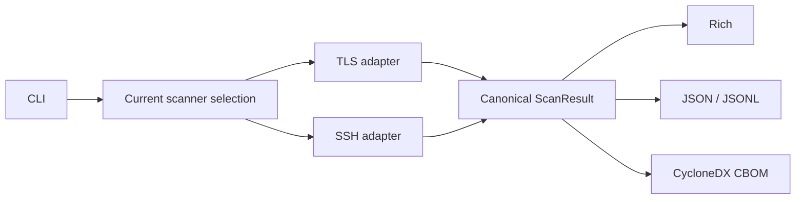

# Scanner contract

## Contents

1. [Current collection contract](#1-current-collection-contract)
2. [Dependency boundary](#2-dependency-boundary)
3. [Deferred extension](#3-deferred-extension)

## 1. Current collection contract

QuReddy currently has TLS and SSH scanners behind a typed collection seam:

```text
CLI -> Scanner[ScanTarget]
      ├── TLSScanner -> ScanResult
      └── SSHScanner -> ScanResult
                         |
                         v
                 Rich / JSON / CBOM / JSONL
                         |
                 Qurum / mint-oscal -> OSCAL
```



`Scanner` owns only collection: a typed subject enters and the existing
`ScanResult` leaves. Renderers and OSCAL conversion stay downstream, where they
have format-specific responsibilities. This is the intended boundary for a
future PKI scanner; the current implementation still has a small amount of
legacy output coupling to TLS helpers, tracked in #462. New output code must
consume canonical core models and neutral semantic facts rather than importing
protocol-private scanner modules.

## 2. Dependency boundary

```text
Protocol adapter -> canonical core models -> posture/output adapters
       |                       |
       +-- owns protocol        +-- owns neutral semantic facts
           vocabulary
```

Protocol adapters own protocol vocabulary and raw collection. Shared policy and
outputs consume canonical models and neutral semantic facts. Output adapters do
not open sockets, invoke OpenSSL, or import protocol-private scanner modules.

## 3. Deferred extension

The future extension point is deliberately deferred: do not add a general
scanner registry or replace `ScanTarget` until a third scanner source is
approved. TLS/OpenSSL group names remain TLS-owned, SSH algorithm names remain
SSH-owned, and only protocol-neutral facts belong in the shared layer.

`scan_ssh` remains as a compatibility function.  `SSHScanner` is a thin adapter
over that implementation, while `TLSScanner` implements the same seam directly.
The adapter is intentionally small and contains no scanning logic.
