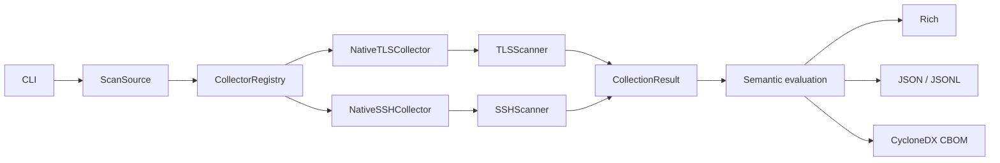

# Scanner contract

## Contents

1. [Current collection contract](#1-current-collection-contract)
2. [Dependency boundary](#2-dependency-boundary)
3. [Deferred extension](#3-deferred-extension)

## 1. Current collection contract

QuReddy currently routes TLS and SSH through a capability-based collector registry:

```text
CLI -> ScanSource -> CollectorRegistry
                       ├── NativeTLSCollector -> TLSScanner
                       └── NativeSSHCollector -> SSHScanner
                                      |
                                      v
                              CollectionResult
                                      |
                              semantic evaluation
                                      |
                         Rich / JSON / CBOM / JSONL
                                      |
                         Qurum / mint-oscal -> OSCAL
```



`Collector` owns acquisition: a validated `ScanSource` enters and a
`CollectionResult` leaves. The result carries findings, evidence, provenance,
and a typed failure state. Semantic evaluation and output rendering stay
downstream. New output code must consume canonical core models and neutral
semantic facts rather than importing protocol-private scanner modules.

## 2. Dependency boundary

```text
Protocol adapter -> canonical core models -> posture/output adapters
       |                       |
       +-- owns protocol        +-- owns neutral semantic facts
           vocabulary
```

Protocol adapters own protocol vocabulary and raw collection. Shared policy and
outputs consume canonical models and neutral semantic facts. Output adapters do
not open sockets, invoke OpenSSL, or import protocol-private scanner modules.

## 3. Deferred extension

The registry is already the extension point. Add a collector only when a third
source is approved. TLS/OpenSSL group names remain TLS-owned, SSH algorithm names
remain SSH-owned, and only protocol-neutral facts belong in the shared layer.

External tools belong behind a collector-owned adapter. They do not introduce a
new output path or a second posture model.

`scan_ssh` remains as a compatibility function.  `SSHScanner` is a thin adapter
over that implementation, while `TLSScanner` implements the same seam directly.
The adapter is intentionally small and contains no scanning logic.
