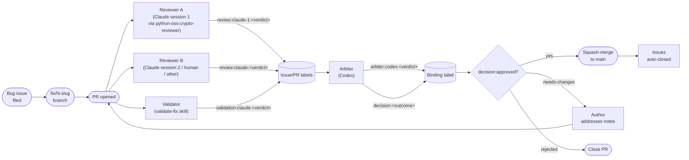

<!-- SPDX-License-Identifier: Apache-2.0 -->

# Review process

How a bug fix lands in QuReddy. This is the operational form of the multi-tier reviewer/arbiter pattern; the policy/rationale lives in [`python-oss-crypto-reviewer/SKILL.md`](../../.claude/skills/python-oss-crypto-reviewer/SKILL.md) and [`validate-fix/SKILL.md`](../../.claude/skills/validate-fix/SKILL.md).

For *why* the project uses three label tiers (Reviewer / Arbiter / Decision), see the reviewer skill. This document is just the diagram + the cookbook.

## The pipeline



## The label tiers

| Tier | Prefix | Who applies | Count per issue | What it means |
|---|---|---|---|---|
| **Reviewer** | `review:<role>-<instance>:<verdict>` | Each individual reviewer | 0..N | Recommendation; informational |
| **Arbiter** | `arbiter:codex:<verdict>` | Only the arbiter | 0 or 1 | Arbiter's verdict, mirrors reviewer namespace for filterability |
| **Validator** | `validation:claude-<instance>:<verdict>` | The validator | 0..N | Mechanical: bug confirmed pre-patch, gone post-patch |
| **Decision** | `decision:<outcome>` | Only the arbiter | 0 or 1 | **Binding.** The merge gate reads this and nothing else. |

### `<role>-<instance>` naming convention

Each Claude session adds an instance suffix so concurrent sessions don't collide. The convention is:

- `review:claude-1:<verdict>` — first Claude session
- `review:claude-2:<verdict>` — second Claude session
- `review:claude-N:<verdict>` — Nth Claude session
- `review:codex:<verdict>` — Codex (single-instance role; no suffix needed)
- `review:human:<verdict>` — human reviewer (single-instance role; no suffix needed)
- `validation:claude-N:<verdict>` — same shape for validator labels

**Rule:** when a Claude session applies a reviewer or validator label, the session must include an instance suffix. **Bare `review:claude:*` and `validation:claude:*` labels are deprecated** — they predate this convention and exist on prior issues (#7, #8, #9, #11, #13, #14, #18, #19, #21, #23 and similar) for audit-trail purposes only.

**Why instance-suffixed:** concurrent sessions are real here. The 2026-04-27 audit caught two sessions committing on each other's branches. Race-prone label semantics ("the latest applier wins") is the wrong default; multiple labels coexisting on the same issue is the correct audit trail.

Verdicts: `approve`, `approve-with-changes`, `reject`.
Decision outcomes: `approved`, `needs-changes`, `rejected`.
Validation verdicts: `validated`, `partial`, `failed`, `needs-clarification`.

## Why three tiers

**Reviewer asks: "is this fix the right approach?"**
Root cause vs symptom. Schema stability. Security invariants. Rejects fixes that paper over bugs or violate contracts.

**Validator asks: "does this fix actually work?"**
Pre-patch reproduction fails. Post-patch reproduction passes. Required regression test is present. No previously-passing test went red.

**Arbiter asks: "given all the inputs, do we merge?"**
Reads every reviewer comment and the validator's verdict. Settles disagreements explicitly. Sets the binding `decision:*` label. The merge gate (CI or human) reads only that one.

The validator is independent of the reviewer because "tests pass" and "issue resolved" are different questions. CI says the first; the validator answers the second by checking out the base commit, running the issue's reproduction (which must fail), then running it on the PR's HEAD (where it must pass).

## Workflow per fix

### 1. Author opens PR

PR body contains `Closes #N` (or multiple — codex bundles coupled fixes per the surgical-fix skill). PR template auto-fills with `### Fidelity to the issue's proposed fix` checkbox.

### 2. Reviewers post verdicts

Each reviewer runs the `python-oss-crypto-reviewer` skill, posts a `## Review:` comment ending with the standard signature block, and applies the matching `review:<name>:<verdict>` label.

```bash
gh pr comment <n> --repo paul007ex/qureddy --body "$(cat review.md)"
gh pr edit <n> --repo paul007ex/qureddy --add-label "review:claude-1:approve"
```

Multiple reviewers can run concurrently. None of them gate merge — they're recommendations.

### 3. Validator runs

The `validate-fix` skill (or its manual procedure if not yet auto-loaded) runs the issue's reproduction at base and at HEAD, runs the new tests 3× to defeat `pytest-rerunfailures` masking, runs the full suite for regression, and runs the Tier 1 quality gates.

```bash
gh pr comment <n> --repo paul007ex/qureddy --body "$(cat validation.md)"
gh pr edit <n> --repo paul007ex/qureddy --add-label "validation:claude:validated"
```

### 4. Arbiter (codex) decides

Codex reads every reviewer comment and the validator's verdict, settles disagreements explicitly with rule citations, runs tests one more time, and posts the binding decision.

```bash
gh pr comment <n> --repo paul007ex/qureddy --body "$(cat arbitration.md)"
gh pr edit <n> --repo paul007ex/qureddy \
    --add-label "arbiter:codex:approve" \
    --add-label "decision:approved"
```

### 5. Merge

Squash-merge per [coding-rules §27.3](coding-rules.md). The `Closes #N` reference auto-closes referenced issues.

```bash
gh pr merge <n> --repo paul007ex/qureddy --squash --delete-branch
```

## Filterable views

```bash
# Ready to merge
gh issue list --repo paul007ex/qureddy --label "decision:approved"

# Reviewed by Claude session 1, awaiting arbiter
gh issue list --repo paul007ex/qureddy \
  --label "review:claude-1:approve" \
  -- -l "arbiter:codex:*"

# Disagreement between two reviewers
gh issue list --repo paul007ex/qureddy \
  --label "review:claude-1:approve" \
  --label "review:claude:reject"

# New PRs needing first review
gh pr list --repo paul007ex/qureddy --state open \
  --json number,labels | jq '[.[] | select(.labels | length == 0) | .number]'
```

## Hard rules

These come from the reviewer and validator skills:

1. **Author cannot review their own PR.** Self-approval is forbidden.
2. **Arbiter must read all reviewer comments before deciding.** Arbiter doesn't shortcut.
3. **Do not edit prior review comments.** Re-review = new comment + label swap. Audit trail is append-only.
4. **No merge without binding decision.** The `decision:*` label is the merge gate. Without it, no merge.
5. **Tests must pass 3× without `Rerun:` markers.** `pytest-rerunfailures` cannot mask deterministic failures. See the cautionary tale in [issue #15](https://github.com/paul007ex/qureddy/issues/15) where 5 hard-failing tests showed as "192 passed."
6. **Reviewer disagreement triggers escalation, not loops.** Per the reviewer skill: "If you can't tell whether you or they are right, propose the test that would settle it. Then run it."

## When the apparatus doesn't apply

- **Docs-only PRs** can skip the validator (nothing to validate against an issue's reproduction). **A reviewer pass (Reviewer mode, non-binding) is still required** — at minimum a `## Review:` comment with verdict and signature block, even when the verdict is `approve` and the diff is one line. Issue #48 documents the canonical failure: PRs #26, #36, #40 self-merged with zero reviews, and the apparatus that was *defining itself* in those PRs got bypassed by its own definitions.
- **Solo work** by the project lead can self-merge per [coding-rules §27.4](coding-rules.md), but the PR record is still required, including at least one reviewer comment. "Self-merged with no review" is acceptable — "merged with no record" is not. The audit trail must distinguish "reviewed and approved" from "self-merged knowingly" from "merged without thinking."
- **CI/dependency bumps** from Dependabot follow GitHub's standard auto-merge rules, not this apparatus.

For everything else — bug fixes, feature work, architecture changes — the full pipeline applies.

### On enforcement

Today this is honor-system. Branch protection that mechanically requires `decision:approved` is **deferred until the repo goes public** (see commit `ea2c042`); enabling it on a private repo costs more than it saves while only the project lead and a small set of agents merge. When the repo flips public, the deferred `scripts/enable-branch-protection.sh` lands and turns this into a hard gate.

Until then: the rules above are followed because they are written down, and PRs that violate them are flagged in retrospective audit (e.g., issue #48). The cost of following them — one `## Review:` comment per docs PR — is small enough that the absence of CI enforcement is not a license to skip.
