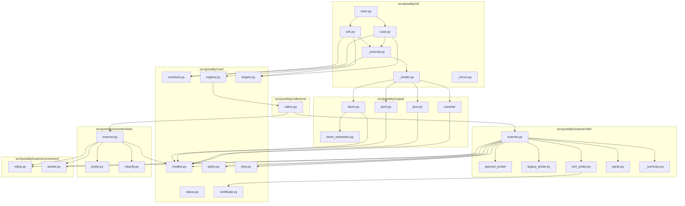
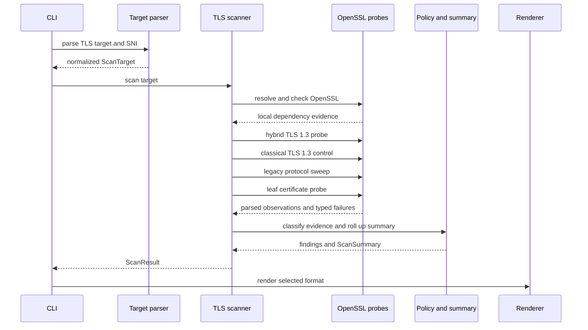
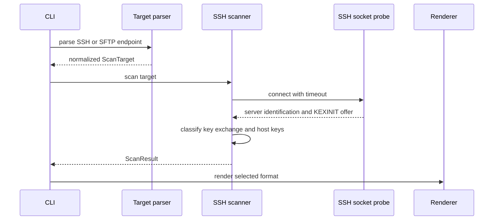
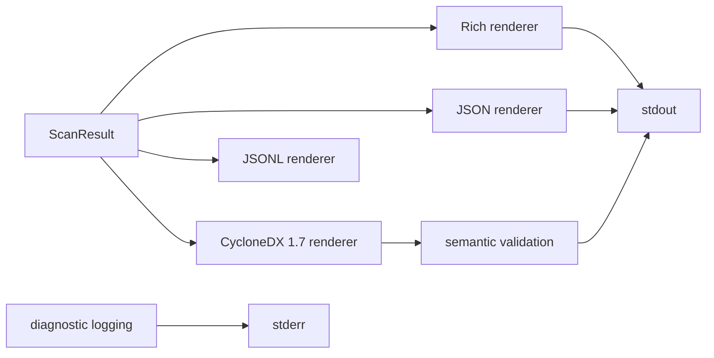
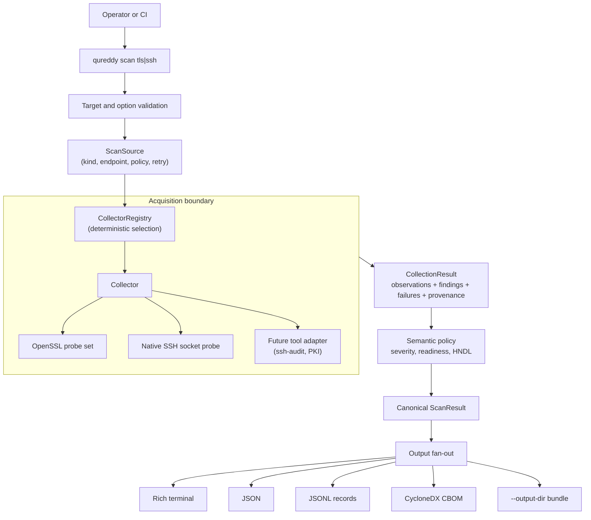
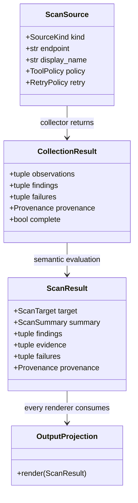
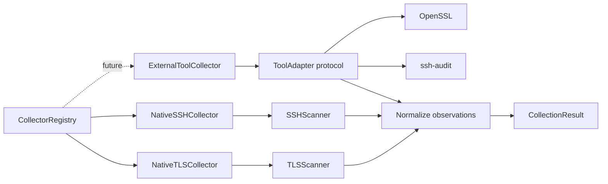
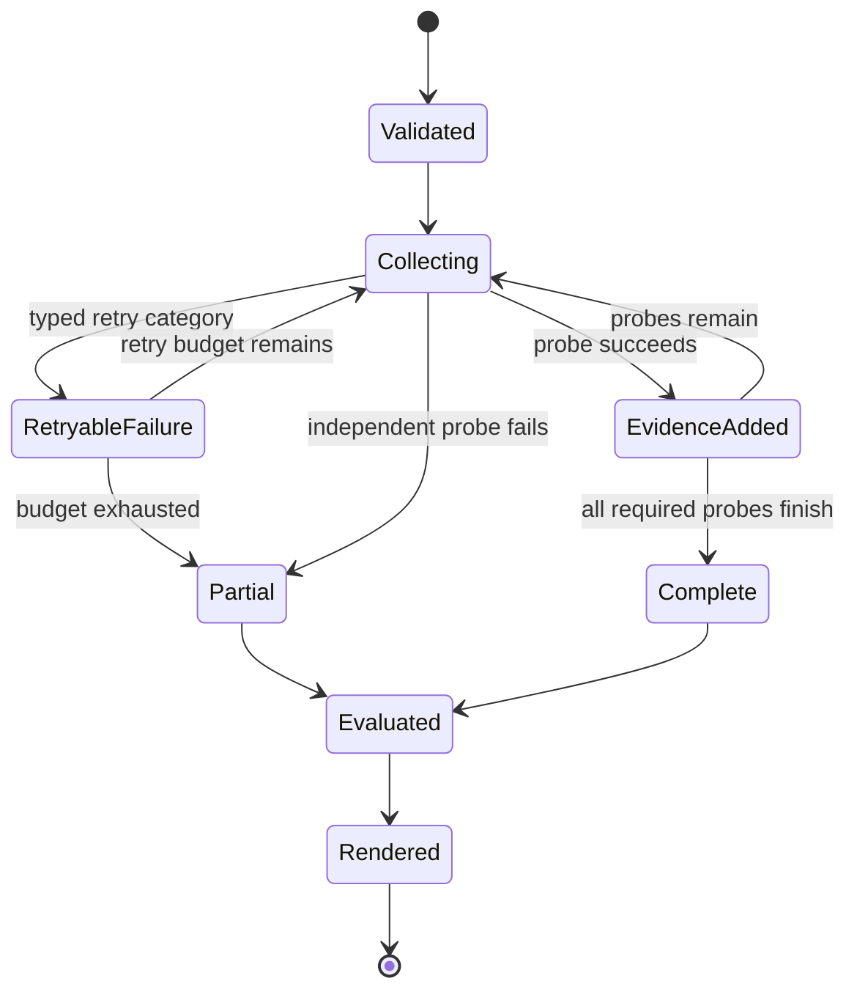
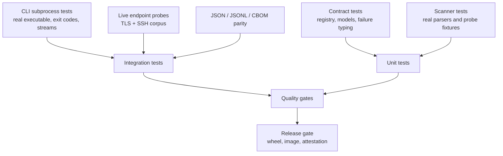
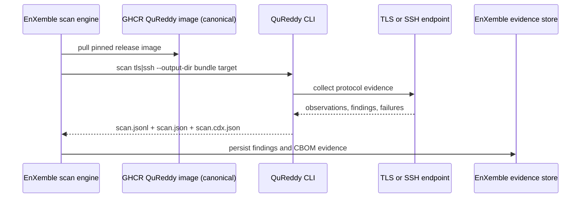

<!-- SPDX-License-Identifier: Apache-2.0 -->

# Architecture

[](https://diataxis.fr/explanation/)

QuReddy has two endpoint scanners behind one typed result model. The TLS path
uses local OpenSSL subprocesses. The SSH path uses a direct socket. Rich, JSON,
JSONL, and CycloneDX renderers consume the same `ScanResult` and do not perform
collection. `--output-dir` executes one scan and fans that result out to all
supported projections.

## Contents

1. [Component map](#1-component-map)
2. [Dependency direction](#2-dependency-direction)
3. [TLS scan flow](#3-tls-scan-flow)
4. [SSH scan flow](#4-ssh-scan-flow)
5. [Output flow](#5-output-flow)
6. [Evidence boundary](#6-evidence-boundary)
7. [Failure routing](#7-failure-routing)
8. [Related documentation](#8-related-documentation)
9. [Runtime topology](#9-runtime-topology)
10. [Canonical result model](#10-canonical-result-model)
11. [Collector and tool-adapter boundary](#11-collector-and-tool-adapter-boundary)
12. [Partial-failure state machine](#12-partial-failure-state-machine)
13. [Test coverage architecture](#13-test-coverage-architecture)
14. [EnXemble integration](#14-enxemble-integration)

## 1. Component map



## 2. Dependency direction

The dependency direction is:

```text
CLI orchestration
    -> target parsing and scanner selection
    -> TLS or SSH collection
    -> typed evidence and findings
    -> Rich, JSON, or CBOM rendering
```

`core` owns shared types, target invariants, retry configuration, status, and
policy. `scanners/common/` owns the cross-protocol readiness/severity rollup and
the stable endpoint-asset builder used by both scanners. Scanner modules produce
`ScanResult`; output modules read that result and write to a caller-supplied
stream. Protocol adapters own protocol vocabulary; shared policy and outputs
consume canonical models and neutral semantic facts. Remaining legacy
output-to-TLS helper imports are tracked in #462 and are not a pattern for new
code.

Renderers do not open sockets, run OpenSSL, or refetch certificates. CBOM uses
the certificate observation captured during the TLS scan.

## 3. TLS scan flow



Every OpenSSL invocation uses an argument vector, an explicit timeout, and
captured streams. Capability inspection happens before target handshakes.
Failures remain typed as local dependency, target, TLS, or parse categories.

The TLS scan can contain partial evidence. Certificate collection, forced key
exchange probes, and legacy protocol probes are separate operations. One
successful operation does not erase another operation's failure.

## 4. SSH scan flow



The probe does not authenticate, invoke an SSH client, open a channel, or
modify the endpoint. It reads the cleartext offer and closes the socket.

## 5. Output flow



Standard output contains the selected result format. Diagnostic logs and
operator hints use standard error.

JSON and CBOM default to quiet logging. Successful machine scans without an
explicit verbosity flag leave standard error empty. Typed failure paths still
emit a structured document. The CLI suppresses its courtesy hint when the
operating system has merged standard error into standard output, preserving
one parseable default machine stream.

Explicit verbosity requests diagnostics. A caller that requests `-v`, `-vv`,
or `-vvv` must keep the streams separate.

## 6. Evidence boundary

Raw network and subprocess text crosses a parser boundary before it becomes
typed evidence. Findings reference that evidence. The summary rolls findings
and failures up without replacing their source records.

The local OpenSSL dependency is collector provenance. It is never remote
implementation identity. CycloneDX represents the endpoint as the metadata
root, local tools under metadata tool provenance, and positively observed
cryptographic assets as components provided by the endpoint.

## 7. Failure routing

| Failure class | Scanner | Exit | Retry |
| --- | --- | --- | --- |
| Local OpenSSL capability | TLS | `3` | never |
| Target connection | TLS and SSH | `2` | TLS allowlist only |
| TLS handshake or middlebox | TLS | `2` | selected allowlist categories |
| Parse failure | TLS and SSH | `2` | TLS `parse_no_group` only |
| Usage or target syntax | TLS and SSH | `4` | never |
| Unhandled internal error | process | `70` | never |

The exact categories and retry state machine are documented in the
[failure category reference](../reference/failure-categories.md).

## 8. Related documentation

- [JSON output](../reference/json-schema.md)
- [CycloneDX CBOM output](../reference/cbom.md)
- [CLI reference](../reference/cli.md)
- [Contributor coding rules](../contributors/coding-rules.md)

## 9. Runtime topology

The process has one orchestration path. Format selection changes serialization,
not collection or policy evaluation.



The acquisition boundary is the only layer allowed to open a socket or execute
a native tool. Policy has no transport dependency. Renderers have no scanner
dependency. This keeps a new source or output from multiplying scan paths.

## 10. Canonical result model



| Model | Owns | Does not own |
| --- | --- | --- |
| `ScanSource` | validated source kind, endpoint, policy, retry options | sockets, subprocesses, rendered text |
| `CollectionResult` | raw observations, typed failures, acquisition provenance | final wording, output formatting |
| `ScanResult` | normalized findings, summary, evidence references | network calls, tool invocation |
| output projection | serialization and presentation | protocol classification or retries |

The same finding identity and evidence reference flow through Rich, JSON,
JSONL, and CBOM. A projection may omit presentation-only fields, but it must
not invent a new readiness or severity calculation.

## 11. Collector and tool-adapter boundary



An external tool is an acquisition implementation, not a second scanner
contract. The adapter records command identity, version, arguments policy,
exit status, timeout, and parsed observations in provenance. Tool output is
untrusted input and crosses the same parser boundary as native probe output.

Adding a tool therefore changes one collector and its tests. It does not add a
new CLI command, policy engine, or renderer.

## 12. Partial-failure state machine



`Partial` is a valid result state. It preserves successful evidence and the
typed failures that explain missing evidence. A failed optional probe cannot
erase an earlier observation, and a successful probe cannot imply that an
unrun probe passed. Exit status, summary wording, and machine output derive
from the same failure records.

## 13. Test coverage architecture



The minimum acceptance path for a new collector is: contract tests, parser
fixtures, a real CLI subprocess test, output parity checks, and a live endpoint
pressure test where network access is available. A renderer-only change still
runs the canonical result and projection tests; it does not duplicate scanner
fixtures.

## 14. EnXemble integration

[BreachSAFE EnXemble](https://github.com/BreachSAFE) is the primary product consumer
of QuReddy. It runs the released container as a subprocess and imports the declared
artifact bundle. QuReddy remains responsible for endpoint collection, evidence, and
CycloneDX CBOM generation; EnXemble owns orchestration, persistence, and user-facing
workflow state.



The integration contract is file-based and process-isolated:

| Artifact | EnXemble use |
| --- | --- |
| `scan.jsonl` | stream findings into the ingestion pipeline |
| `scan.json` | retain complete scan evidence and summary |
| `scan.cdx.json` | pass the CycloneDX CBOM to downstream inventory and OSCAL tooling |
| `scan.rich.txt` | retain an operator-readable report for troubleshooting |

EnXemble accepts exit code `0` for a complete scan and `2` for a target-level
failure when the bundle is still present. Exit codes `3`, `4`, and `70` remain
hard failures. This preserves QuReddy's failure contract at the integration
boundary.
