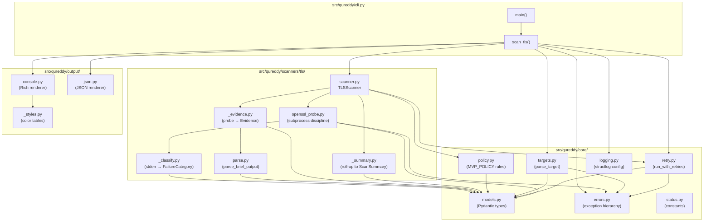
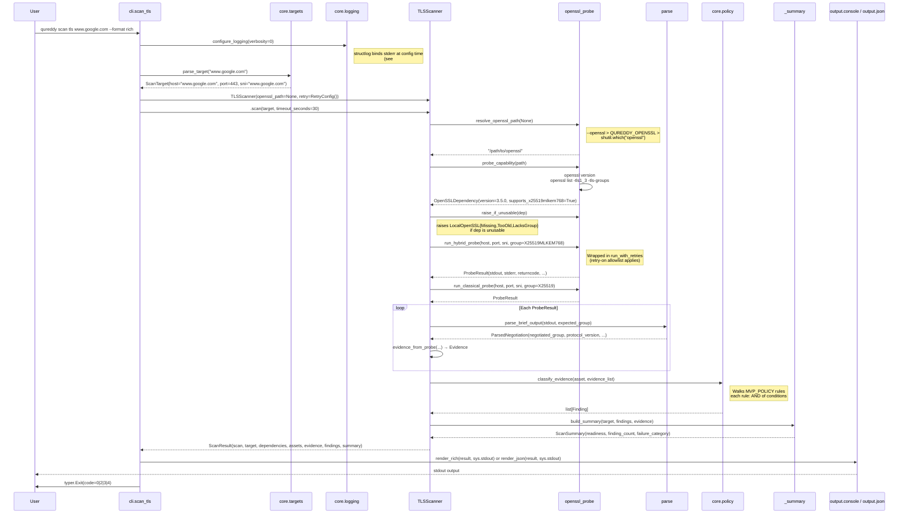
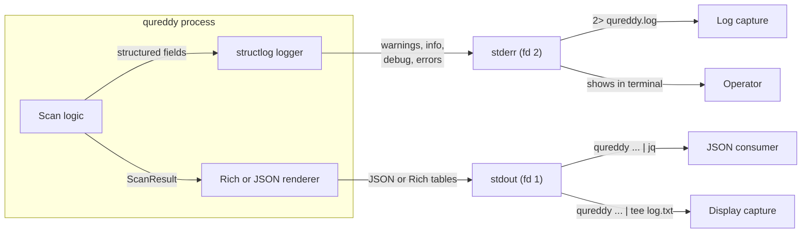
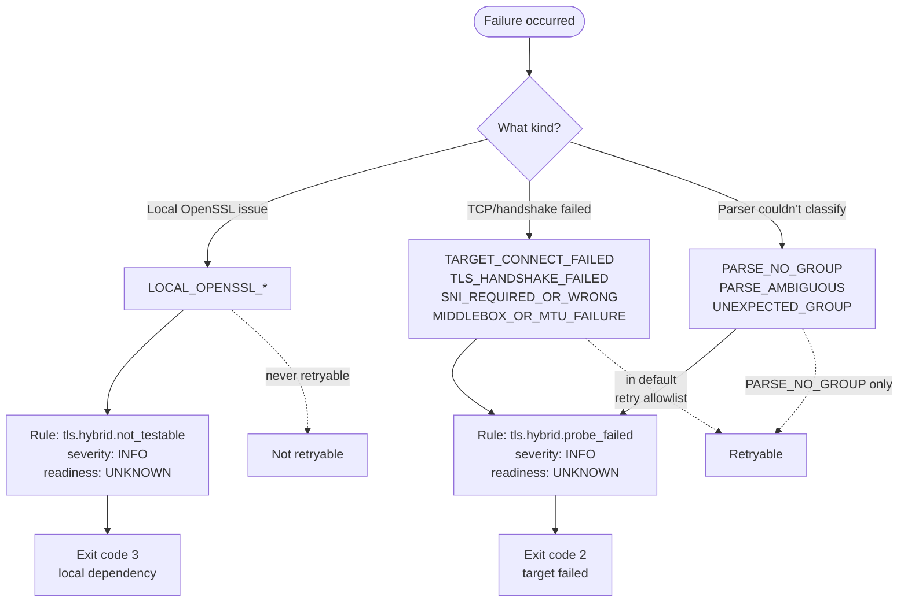

<!-- SPDX-License-Identifier: Apache-2.0 -->

# Architecture

How QuReddy's TLS scanner is wired together. This document is for contributors who want to understand the codebase's shape before changing it.

For *why* the architecture is what it is — design tradeoffs, alternatives considered — see the [ADR index](../contributors/adr/). For *what* the scanner outputs, see [JSON schema](../reference/json-schema.md). This document covers the *what is here* layer.

## Module map

**Reading the graph:**

- **`core/`** is the foundation. Everything imports `models.py` (the Pydantic type layer). `errors.py` is the exception hierarchy. No `core/` module imports from `scanners/` or `output/` — strict downward dependency.
- **`scanners/tls/`** is the scan engine. `scanner.py` is the orchestrator; `openssl_probe.py` is the only place in the codebase that calls `subprocess` (single-call discipline per [coding-rules §7](../contributors/coding-rules.md)).
- **`output/`** is the renderer layer. Reads `ScanResult`, writes to a stream. Never reads `subprocess`, never raises domain exceptions.
- **`cli.py`** wires it all together at the top level. It is the only module that mixes scanner, output, and CLI parsing concerns.

## Scan flow

What happens when a user runs `qureddy scan tls www.google.com`:

**Key invariants:**

- **The CLI never calls `subprocess` directly.** All process spawning goes through `openssl_probe`. If you find `subprocess.run` outside that file, it's a bug per [coding-rules §7](../contributors/coding-rules.md).
- **Capability check happens before any probe runs.** `_check_capability` raises `LocalOpenSSL*` exceptions if the binary is missing, too old, or lacks the hybrid group — those exit with code 3 and skip the probe phase entirely.
- **Hybrid and classical probes both run unconditionally.** The classical probe is the control — its purpose is to detect "server prefers PQ when offered both" vs "server only knows classical."
- **Parsing is fixture-driven and stream-aware.** The parser anchors on ServerHello-derived lines (`Negotiated TLS1.3 group:` / `Peer Temp Key:`) and ignores ClientHello-derived noise.
- **Findings are produced by policy.** The hardcoded `MVP_POLICY` table in `core/policy.py` defines the four rules; each rule fires once per matching evidence. No YAML loading, no plugin system at MVP 0.1.

## Output stream contract

A scan emits two streams. They are not interchangeable.

**The contract:**

- **stdout = scan results only.** Nothing else. JSON output must be parseable by `json.loads(stdout)`. Rich output is the only thing on stdout in `--format rich` mode.
- **stderr = everything else.** Logs, progress, warnings, errors, capability messages, retry signals.
- **`2>&1` merges them** at the OS level, after our process has written. Tools that combine streams will see logs interleaved with output — that's expected.

**Bug class this prevents:** if a logger inadvertently binds `sys.stdout` (or if structlog's writer is captured at the wrong moment, as in [issue #15](https://github.com/paul007ex/qureddy/issues/15)), JSON consumers downstream get `JSONDecodeError`. The contract is "no log line ever lands on stdout, period." Reviewers reject any change that violates this.

## Failure category routing

The scanner produces a `FailureCategory` enum value when something goes wrong. The category determines:

1. **Exit code** the CLI returns
2. **Whether the failure is retryable** under `--retry-on`
3. **What rule the policy fires** to produce the user-visible finding

**The retryable allowlist** lives in `core/retry.py` as `RETRYABLE_CATEGORIES`. A user can opt into retries with `--retry-on <category>,<category>` but only categories on the allowlist are accepted; passing a non-allowlisted category fails with exit 4 (usage error).

**Why local failures aren't retryable:** an OpenSSL binary that's missing/too-old/lacking-the-group will not fix itself by waiting and trying again. The retry budget is for transient network conditions, not for client-side configuration problems.

## Where to read next

| If you want to... | Read |
|---|---|
| understand a specific module's role | the module's docstring (every file in `src/qureddy/` has one) |
| follow the JSON output schema | [json-schema.md](../reference/json-schema.md) |
| see all CLI flags | [cli.md](../reference/cli.md) |
| see the exit-code contract | [exit-codes.md](../reference/exit-codes.md) |
| understand a `FailureCategory` value | [failure-categories.md](../reference/failure-categories.md) |
| change the code | [coding-rules.md](../contributors/coding-rules.md) first |
| review someone else's change | [the review apparatus](review-process.md) (TODO) and the `python-oss-crypto-reviewer` skill |
| add a new scanner (MVP 0.2+) | the `mvp-implement` skill |
