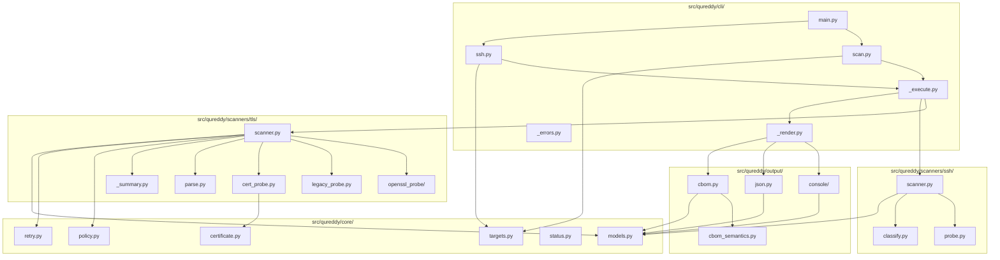
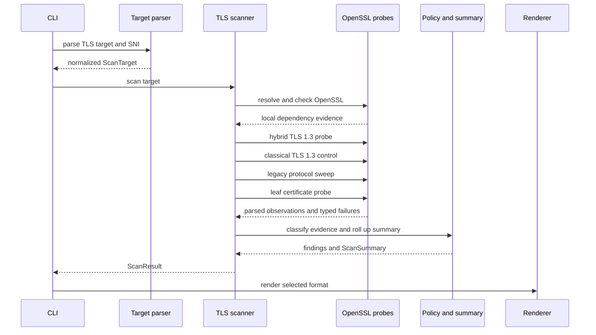
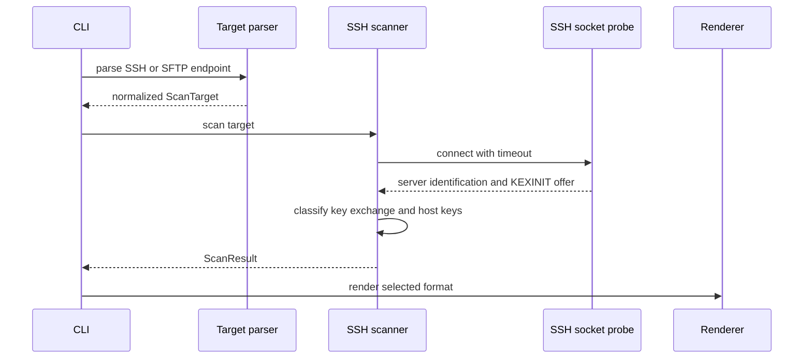
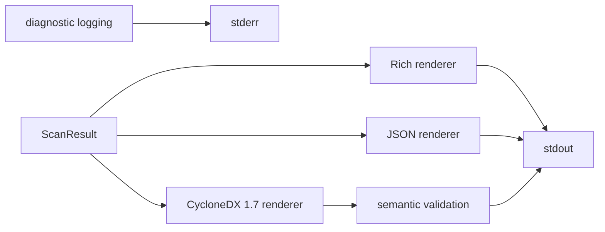

<!-- SPDX-License-Identifier: PolyForm-Noncommercial-1.0.0 -->

# Architecture

QuReddy has two endpoint scanners behind one typed result model. The TLS path
uses local OpenSSL subprocesses. The SSH path uses a direct socket. Rich, JSON,
and CycloneDX renderers consume the same `ScanResult` and do not perform
collection.

## Contents

1. [Component map](#1-component-map)
2. [Dependency direction](#2-dependency-direction)
3. [TLS scan flow](#3-tls-scan-flow)
4. [SSH scan flow](#4-ssh-scan-flow)
5. [Output flow](#5-output-flow)
6. [Evidence boundary](#6-evidence-boundary)
7. [Failure routing](#7-failure-routing)
8. [Related documentation](#8-related-documentation)

## 1. Component map



## 2. Dependency direction

The dependency direction is:

```text
CLI orchestration
    -> target parsing and scanner selection
    -> TLS or SSH collection
    -> typed evidence and findings
    -> Rich, JSON, or CBOM rendering
```

`core` owns shared types, target invariants, retry configuration, status, and
policy. Scanner modules produce `ScanResult`. Output modules read that result
and write to a caller-supplied stream.

Renderers do not open sockets, run OpenSSL, or refetch certificates. CBOM uses
the certificate observation captured during the TLS scan.

## 3. TLS scan flow



Every OpenSSL invocation uses an argument vector, an explicit timeout, and
captured streams. Capability inspection happens before target handshakes.
Failures remain typed as local dependency, target, TLS, or parse categories.

The TLS scan can contain partial evidence. Certificate collection, forced key
exchange probes, and legacy protocol probes are separate operations. One
successful operation does not erase another operation's failure.

## 4. SSH scan flow



The probe does not authenticate, invoke an SSH client, open a channel, or
modify the endpoint. It reads the cleartext offer and closes the socket.

## 5. Output flow



Standard output contains the selected result format. Diagnostic logs and
operator hints use standard error.

JSON and CBOM default to quiet logging. Successful machine scans without an
explicit verbosity flag leave standard error empty. Typed failure paths still
emit a structured document. The CLI suppresses its courtesy hint when the
operating system has merged standard error into standard output, preserving
one parseable default machine stream.

Explicit verbosity requests diagnostics. A caller that requests `-v`, `-vv`,
or `-vvv` must keep the streams separate.

## 6. Evidence boundary

Raw network and subprocess text crosses a parser boundary before it becomes
typed evidence. Findings reference that evidence. The summary rolls findings
and failures up without replacing their source records.

The local OpenSSL dependency is collector provenance. It is never remote
implementation identity. CycloneDX represents the endpoint as the metadata
root, local tools under metadata tool provenance, and positively observed
cryptographic assets as components provided by the endpoint.

## 7. Failure routing

| Failure class | Scanner | Exit | Retry |
| --- | --- | --- | --- |
| Local OpenSSL capability | TLS | `3` | never |
| Target connection | TLS and SSH | `2` | TLS allowlist only |
| TLS handshake or middlebox | TLS | `2` | selected allowlist categories |
| Parse failure | TLS and SSH | `2` | TLS `parse_no_group` only |
| Usage or target syntax | TLS and SSH | `4` | never |
| Unhandled internal error | process | `70` | never |

The exact categories and retry state machine are documented in the
[failure category reference](../reference/failure-categories.md).

## 8. Related documentation

- [JSON output](../reference/json-schema.md)
- [CycloneDX CBOM output](../reference/cbom.md)
- [CLI reference](../reference/cli.md)
- [Contributor coding rules](../contributors/coding-rules.md)
