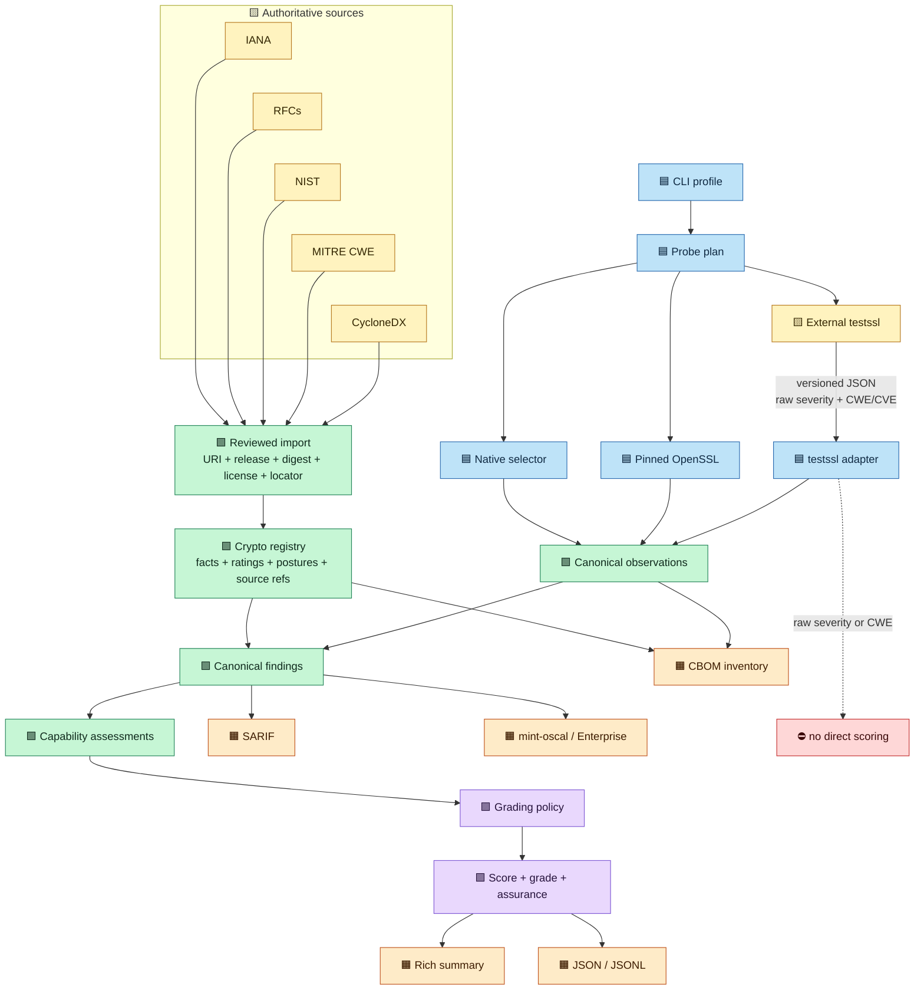

<!--
SPDX-FileCopyrightText: 2026 BreachSAFE
SPDX-License-Identifier: Apache-2.0
-->

# Crypto registry reference

[](https://diataxis.fr/reference/)

This page describes the proposed `qureddy-crypto-registry.json` contract tracked by issue #708. The current review fixture is [`qureddy-crypto-registry.proposed.json`](../architecture/examples/qureddy-crypto-registry.proposed.json).

## Contents

1. [Contract status](#1-contract-status)
2. [Requirements language and terms](#2-requirements-language-and-terms)
3. [Registry responsibility](#3-registry-responsibility)
4. [Document fields](#4-document-fields)
5. [Source records](#5-source-records)
6. [Postures and ratings](#6-postures-and-ratings)
7. [Algorithms](#7-algorithms)
8. [Protocol wire identities](#8-protocol-wire-identities)
9. [Evidence types](#9-evidence-types)
10. [CWE, CVE, and external scanner data](#10-cwe-cve-and-external-scanner-data)
11. [Validation and integrity](#11-validation-and-integrity)
12. [Security considerations](#12-security-considerations)
13. [Consumer contract](#13-consumer-contract)
14. [Lifecycle and compatibility](#14-lifecycle-and-compatibility)
15. [References](#15-references)

## 1. Contract status

| Property | Value |
| --- | --- |
| Maturity | Proposed |
| Governing issue | #708 |
| Governing ADR | [Separate crypto facts, probe plans, and grading policy](../architecture/weak-cipher-classification-adr.md) |
| Proposed schema | `https://qureddy.io/schemas/crypto-registry/v1/schema.json` |
| Proposed registry ID | `qureddy-crypto-registry` |
| Review fixture | `docs/architecture/examples/qureddy-crypto-registry.proposed.json` |
| Runtime availability | Not implemented |

The schema URI records the intended stable identifier. Until #708 is accepted, consumers MUST NOT treat the review fixture as a released registry.

## 2. Requirements language and terms

Capitalized requirement terms follow BCP 14 as defined by RFC 2119 and clarified by RFC 8174.
Lowercase uses of these words retain their ordinary meaning.

| Term | Definition |
| --- | --- |
| Fact | A sourced property of an algorithm, protocol entry, or external vocabulary |
| Rating | A sourced interpretation on the classical, quantum, or deployment axis |
| Posture | A stable identifier summarizing one rating axis |
| Observation | Evidence recorded by a collector during one scan |
| Finding | A canonical interpretation that links observations to registry ratings |
| Assessment | A protocol-neutral capability conclusion consumed by grading policy |
| Consumer | Code that loads the registry or consumes identities derived from it |

Conformance requires complete validation, reference resolution, and the Section 11 failure behavior.

## 3. Registry responsibility

The registry is the proposed owner of reusable cryptographic facts and sourced interpretations:

- algorithm identity and CycloneDX crypto properties;
- protocol wire identifiers and algorithm decomposition;
- classical, quantum, and deployment postures;
- reason codes and source references;
- evidence-type definitions; and
- exact source provenance.

The registry does not own:

| Concern | Owner |
| --- | --- |
| Which checks a CLI profile executes | Probe plan |
| Timeouts, attempt limits, and backend routing | Probe plan |
| Observations from a specific scan | `ScanResult` evidence |
| Score weights, grade bands, gates, and caps | Grading policy |
| Framework and control mappings | mint-oscal policy packs |
| Organizational scope and approval | Enterprise |
| Raw testssl severity, CWE, CVE, or finding text | testssl adapter evidence |

### Processing flow

Figure 1 shows the proposed registry inputs, acquisition boundary, canonical interpretation, and
output ownership. Text labels carry the same meaning as color.



Text-only equivalent:

```text
IANA + RFCs + NIST + MITRE CWE + CycloneDX
                       |
                       v
              reviewed import ---> crypto registry
                                         |
profile ---> probe plan ---> collectors ---> canonical observations
                                         |             |
                                         +-------------+
                                                       v
canonical findings ---> capability assessments ---> grading policy ---> score
        |                                                      |
        +---> CBOM / SARIF / mint-oscal             Rich / JSON / JSONL

testssl raw severity or CWE --------X--------> direct score change
```

Plain-text path: reviewed authorities build the registry. Probe plans control acquisition.
Collectors and adapters emit observations. The registry interprets observations into findings and
assessments. The grading policy scores assessments. Renderers project canonical results.

## 4. Document fields

The proposed document has these top-level fields:

| Field | Type | Required | Meaning |
| --- | --- | --- | --- |
| `$schema` | URI string | Yes | Stable schema identifier |
| `schema_version` | semantic-version string | Yes | Registry schema version |
| `status` | enum | Yes | `proposal` for the review fixture |
| `registry_id` | string | Yes | Stable registry family identifier |
| `registry_version` | version string | Yes | Version of the fact set |
| `effective_date` | ISO 8601 date | Yes | Date the fact set becomes applicable |
| `vocabularies` | object | Yes | External vocabularies used by registry fields |
| `sources` | object map | Yes | Pinned authoritative source records |
| `postures` | object map | Yes | Stable posture identifiers and axes |
| `evidence_types` | object map | Yes | Observation types consumers may emit |
| `algorithms` | object map | Yes | Reusable algorithm facts and ratings |
| `protocols` | object map | Yes | Protocol-specific wire identities |
| `integrity` | object | Yes | Publication digest state and scope |

The loader MUST reject unknown top-level fields.

### Publication-to-runtime mapping

The publication document is a review contract, not the serialized form of the shipped
`CatalogDefinition` model. The loader tracked by #708 must validate this envelope, normalize its
keyed source, algorithm, and protocol maps into `CatalogDefinition`, and then call
`compile_catalog`. The resulting `CryptoCatalogSnapshot` is the only classification surface used
by scanners and renderers.

The normalization is one way and deterministic. Map keys become stable entity IDs, CBOM
`algorithmProperties` become `AlgorithmFacts`, protocol algorithm references become
`AlgorithmUse` records, and each rating retains its own `posture_id`. Publication-only metadata,
including schema and effective dates, remains in the validated envelope and receipt. Activation
requires parity tests that prove the publication document and compatibility data compile to the
same snapshot over their shared entries.

Normalization explicitly maps CycloneDX names such as `classicalSecurityLevel`,
`nistQuantumSecurityLevel`, and `parameterSetIdentifier` to the internal model fields. The loader
must not rely on Pydantic serialization aliases as input aliases.

## 5. Source records

Every fact or rating that requires an authority refers to an entry in `sources`. A source record
contains:

| Field | Meaning |
| --- | --- |
| `kind` | Source class such as `iana-registry`, `rfc`, or `nist-publication` |
| `title` | Published source title |
| `uri` | Canonical retrieval location |
| `release` | Publication, registry, or draft version |
| `retrieved` | Date the source bytes were retrieved |
| `sha256` | Digest of the reviewed source bytes |
| `license` | Applicable source terms or license |

A `source_ref` contains a `source_id` and exact `locator`. Every rating MUST contain at least one resolvable source reference.

## 6. Postures and ratings

Postures are stable cross-protocol interpretation identifiers. Each posture belongs to one axis.

| Proposed posture | Axis | Meaning |
| --- | --- | --- |
| `crypto.classically_weak` | `classical` | A constituent is prohibited, broken, or below current classical policy |
| `crypto.quantum_vulnerable` | `quantum` | A constituent is vulnerable to a cryptographically relevant quantum computer |
| `crypto.discouraged` | `deployment` | An authority discourages deployment without necessarily establishing a break |

Classical and quantum postures are independent. A classically sound RSA or elliptic-curve key
exchange can still be quantum-vulnerable. A symmetric primitive can be classically weak without
being meaningfully described by a post-quantum algorithm category.

A rating contains:

| Field | Meaning |
| --- | --- |
| `posture_id` | Stable posture established by this rating |
| `verdict` | Interpretation on the rating axis |
| `reason_codes` | Stable machine-readable reasons |
| `source_refs` | Exact authorities for the interpretation |

IANA `Recommended` values retain their source meanings. `Y` is recommended, `D` is discouraged,
and `N` means no general IETF recommendation. `N` alone does not create a weak-cipher finding.

## 7. Algorithms

Each `algorithms` key is a stable QuReddy algorithm identifier. The value contains a display name,
CycloneDX-aligned crypto properties, optional sourced ratings, and posture references.

```json
{
  "rc4-128": {
    "name": "RC4-128",
    "cryptoProperties": {
      "assetType": "algorithm",
      "algorithmProperties": {
        "primitive": "stream-cipher",
        "parameterSetIdentifier": "128"
      }
    },
    "fact_source_refs": [
      {"source_id": "rfc7465", "locator": "section-2"}
    ],
    "ratings": {
      "classical": {
        "posture_id": "crypto.classically_weak",
        "verdict": "classically_weak",
        "reason_codes": ["rc4_prohibited"],
        "source_refs": [{"source_id": "rfc7465", "locator": "section-2"}]
      }
    }
  }
}
```

CycloneDX field names are used where they exist, including `primitive`,
`classicalSecurityLevel`, `nistQuantumSecurityLevel`, `parameterSetIdentifier`, and
`certificationLevel`. QuReddy-specific facts use separate names only where CycloneDX has no
equivalent. For example, a proposed `block_bits` extension can retain the 64-bit block fact needed
to explain SWEET32.

`certificationLevel` requires evidence about a particular implementation certification. It MUST NOT
be inferred from the algorithm name. Confidence describes an observation and belongs in scan
evidence, not static `algorithmProperties`.

## 8. Protocol wire identities

The `protocols` map connects wire identifiers to reusable algorithm records. A TLS cipher-suite
record contains:

| Field | Meaning |
| --- | --- |
| `name` | IANA cipher-suite name |
| `allocation` | IANA allocation state |
| `iana` | IANA recommendation, DTLS status, and source row |
| `algorithm_refs` | Constituent key-establishment, confidentiality, and authentication algorithms |
| `ratings` | Protocol-entry interpretations that do not belong to one constituent |
| effective posture IDs | Derived from constituent and protocol-entry ratings after compilation |

Algorithm decomposition prevents cipher-suite names from becoming the rating source. TLS, SSH, IKE,
and future protocol adapters can reference the same algorithm and posture identities. An algorithm
or protocol entry does not author a second `posture_ids` list; `Rating.posture_id` is authoritative.

## 9. Evidence types

`evidence_types` defines stable observation names. It does not contain observations from a scan.
For example, `tls.cipher.selected` means a ServerHello selected the exact cipher suite that the
probe offered.

An emitted observation records the evidence type, target reference, observed value, confidence,
collector, registry identity, and probe-plan identity. The observation remains separate from its
registry-derived finding.

## 10. CWE, CVE, and external scanner data

Issue #722 tracks a planned external testssl adapter for `--deep` and `--vuln` scanning. testssl
emits tool IDs, severities, finding text, Common Vulnerabilities and Exposures (CVE) identifiers,
and Common Weakness Enumeration (CWE) identifiers. The adapter MUST retain these values as imported
evidence with the testssl version and invocation mode.

The following paths are prohibited:

```text
testssl severity ----------X----------> QuReddy score
raw CWE count -------------X----------> point deduction
raw testssl finding text --X----------> registry rating
```

CWE classifies a weakness family. It does not establish exploitability or severity for a target.
The planned adapter maps a tool ID to a canonical QuReddy finding type. The registry then supplies
the reviewed crypto rating and reason code. A future curated `taxonomy_refs` field may associate a
canonical reason with a pinned MITRE CWE entry. That extension requires a pinned CWE release,
digest, source terms, schema review, and issue acceptance before it enters the registry.

Non-algorithm vulnerabilities, including implementation memory-safety defects, do not belong in
the crypto registry. Their canonical finding mappings require a separate vulnerability or adapter
mapping contract.

## 11. Validation and integrity

The proposed loader MUST reject:

- unknown fields;
- malformed or duplicate identifiers;
- unresolved source, posture, algorithm, or evidence-type references;
- invalid CycloneDX primitive or property values;
- unsupported IANA recommendation values;
- ratings without source references;
- contradictory posture and rating axes; and
- a published registry whose digest does not match its declared bytes.

Validation is atomic. A loader MUST NOT expose a partially parsed registry, skip an invalid entry,
or continue with a previous registry while reporting the new identity. A validation error MUST name
the failing JSON path and stable error code. Diagnostic text belongs on standard error when invoked
through a CLI. Machine output on standard output MUST remain parseable.

The loader MUST also reject owner-level `posture_ids` fields. Effective posture IDs are derived
from validated ratings so one owner cannot publish two independent answers for the same fact.

The review fixture uses `integrity.state: unpublished-proposal`. A released registry MUST replace
that state with a digest over defined canonical bytes. The registry MUST NOT include a digest over
itself without an explicit digest-exclusion rule.

## 12. Security considerations

The registry controls security interpretation and therefore forms part of QuReddy's trusted input.
An attacker who changes a rating, source reference, posture, or wire identity can suppress a finding
or create a false finding.

The initial implementation MUST load packaged or explicitly selected local registry bytes. It MUST
NOT fetch mutable registry content during a scan. A future remote distribution mechanism requires
authenticated transport, a pinned content digest or signature, rollback protection, bounded input,
and an atomic local activation step.

The loader MUST bound document size, collection lengths, identifier lengths, and source locators.
It MUST reject duplicate JSON keys before model construction. It MUST NOT execute source URIs,
interpret registry strings as commands, or pass registry values through a shell.

The registry contains no target observations or credentials. External scanner evidence may contain
target identifiers and diagnostic text; that evidence follows the `ScanResult` data-handling policy
and does not enter the registry.

## 13. Consumer contract

| Consumer | Reads | Must not do |
| --- | --- | --- |
| Probe-plan resolver | Wire identities, allocation, and posture selectors | Change a registry rating |
| Native and OpenSSL adapters | Resolved candidate identities | Infer policy from display names |
| testssl adapter | Canonical IDs needed for normalization | Promote raw severity into a registry verdict |
| Finding evaluator | Ratings, postures, reasons, and sources | Count duplicate observations as new weaknesses |
| Rich, JSON, and JSONL renderers | Canonical findings and assessments | Reclassify output independently |
| CBOM renderer | CycloneDX-aligned algorithm facts and canonical evidence | Put score fields inside `algorithmProperties` |
| Grading engine | Canonical capability assessments | Parse TLS names or raw scanner output |
| mint-oscal | Stable evidence, posture, and reason IDs | Write framework mappings back into the registry |

Every result that depends on the registry MUST record `registry_id`, `registry_version`, and the
published registry digest. This receipt lets a consumer reproduce which facts and ratings were in
force for the scan.

## 14. Lifecycle and compatibility

Registry schema and content versions change independently:

| Change | Version effect |
| --- | --- |
| Add a source-backed algorithm or wire identity without changing shape | Registry content version |
| Change a rating or source | Registry content version and release review |
| Add or remove a required field | Schema major version |
| Add an optional backward-compatible field | Schema minor version |
| Correct prose without changing machine meaning | Schema patch version when republished |

Consumers MUST reject unsupported schema major versions. Consumers MUST ignore neither unknown
fields nor unknown rating axes. A content update MUST NOT silently change `registry_version` in
place. Previously published registry bytes and digests remain immutable.

Release review MUST validate source digests, reference resolution, deterministic serialization,
consumer compatibility, JSON and CBOM parity, and grading-policy compatibility. A rating change is
observable product behavior even when scanner code is unchanged.

## 15. References

Normative sources for the proposed contract:

- [BCP 14](https://www.rfc-editor.org/info/bcp14), requirement terms.
- [IANA TLS Parameters](https://www.iana.org/assignments/tls-parameters/), TLS wire identities.
- [CycloneDX 1.7 JSON Schema](https://cyclonedx.org/schema/bom-1.7.schema.json), crypto-property
  vocabulary.
- [RFC 7465](https://www.rfc-editor.org/rfc/rfc7465), RC4 prohibition.
- [RFC 9847](https://www.rfc-editor.org/rfc/rfc9847), IANA recommendation semantics.
- [NIST IR 8547 initial public draft](https://doi.org/10.6028/NIST.IR.8547.ipd), quantum-vulnerable
  public-key schemes.

Repository references:

- [Registry architecture ADR](../architecture/weak-cipher-classification-adr.md)
- [Proposed crypto registry fixture](../architecture/examples/qureddy-crypto-registry.proposed.json)
- [Proposed weak-cipher probe plan](../architecture/examples/tls-weak-ciphers-probe-plan.proposed.json)
- [Proposed grading policy](../architecture/examples/quantum-readiness-grading-policy.proposed.json)
- [Proposed score result](../architecture/examples/quantum-readiness-result.proposed.json)
- [CycloneDX CBOM output](cbom.md)
- [JSON output schema](json-schema.md)
- QuReddy issues #599, #630, #669, #700, #708, #709, #710, #718, and #722
